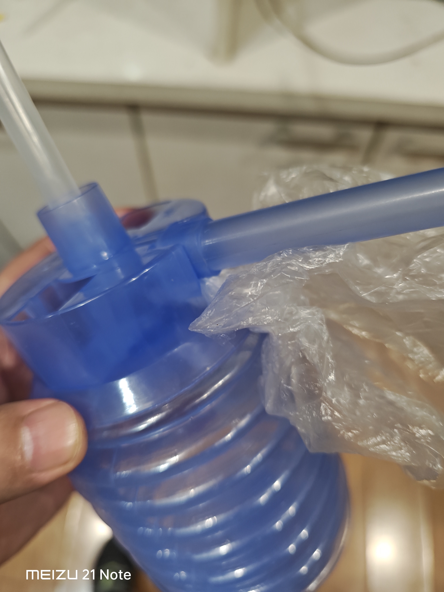

今天在公司解决了一个困扰我两天的小麻烦，实在忍不住想记下来。

我们茶水间用的是那种桶装纯净水，上面扣一个手动打压的塑料取水器。就是那种压几下气，水就顺着管子流出来的装置。那个黄色的小按钮是泄压阀，一按就“呲”地放气，水立刻就停，平时用着挺顺手。

坏就坏在这个按钮上——准确地说，它已经不是“坏”，而是直接消失了。昨天我去接水的时候，发现那个黄色的小按钮整个掉了，泄压阀的位置只剩下一个光溜溜的小孔。我当时试着压了几下，空气“呲呲”全从孔里漏出去，水根本打不上来。脑子一懵，第一个念头不是去想办法堵孔或者夹管子，而是——我直接把那桶水抱起来了。

对，就是双手抱着桶，像倒汽油一样往杯子里灌。结果桶里的水一涌一涌地“缓气”，哗啦一下，杯子里一半，桌子上全是。手忙脚乱擦了半天，还被同事打趣说我是在浇花。昨天就那么狼狈地过去了，心里还琢磨着是不是得报修换设备。

今天再去打水，盯着那个小孔看了几秒钟，脑子里闪过之前想的原理：打压就是把气封在桶里把水逼出来，停水就是把这个气放掉。那我现在不就是缺个“盖子”吗？

顺手从抽屉里扯了一个装面包的小塑料袋，揉吧揉吧团成一个软塞子，往那个孔上一怼——嘿，严丝合缝。再一压气，水乖乖地流出来了。要停水的时候，捏住塑料袋往外一拔，“噗”一声，气跑光了，水说停就停，比原来按钮还利索。

那一刻简直觉得自己是手工耿附体。

后来我反复试了几次，越用越顺手。唯一要注意的是，拔塞子的时候会喷出一小股气，可能带几滴水星子，手别正对着孔就行。塑料袋团用久了可能会被气压挤变形，密封不行了再重新揉一个换上，反正抽屉里多的是。

就这么着，一个破塑料袋，把一个濒临报废的取水器又给盘活了。想想昨天抱着桶洒一桌子的狼狈，今天这个一分钟都不到的操作，真是又好笑又有点小得意。

有时候解决问题真不一定需要多专业的工具，想通它那点工作原理，身边的小破烂儿都能派上大用场。好了，今天的水打得很顺畅，杯子终于不用再游泳了。