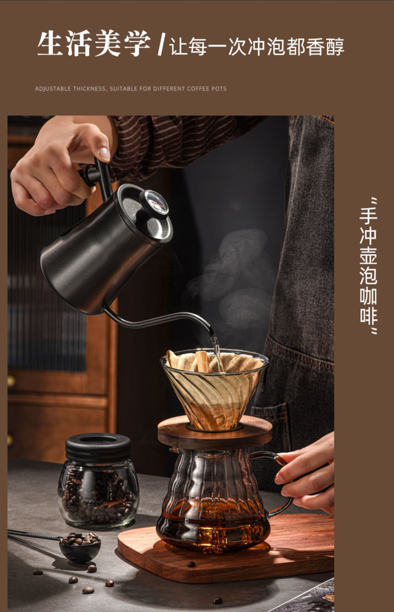

---
title:      "如何在家里制作一杯美味的手冲咖啡"
slug: "如何在家里制作一杯美味的手冲咖啡"
date:       2023-04-27
categories:  ['分享']
tags: ['分享']
---

在家里享用一杯美味的手冲咖啡是一种令人愉悦的体验。不仅仅是因为手冲咖啡中保留了咖啡豆最纯真的香气和风味，也有了准备的乐趣。今天我们将教您如何自制一杯美味的手冲咖啡。
<!--more-->
第一步是选择新鲜的咖啡豆。如果你希望获得最佳的风味和口感体验，那么建议购买新鲜的咖啡豆，并在煮咖啡前新鲜磨豆。磨豆器是一种非常有用的工具，可以将咖啡豆磨成适合手冲的细腻豆渣。

现在，将咖啡滤纸放到滤纸杯中，然后用刚刚沸腾的水将其彻底湿润，以去除任何滤纸中的杂质味道。然后将磨好的咖啡豆放在滤纸杯里，然后轻轻晃动，使咖啡豆均匀分布。

接下来是倒水环节，首先倒入一个小量的水，让豆渣充分接触水分后膨胀，这个过程我们称之为“膨胀期”。大概30秒后，再倒入剩余的水，温度约为90℃左右，并将水徐徐地倒入，以极度减少水流的破坏性。建议您使用一个专业的注水壶来控制水流的速度和温度。

等待4-5分钟，咖啡慢慢被过滤出来，这时您就可以品尝自制的手冲咖啡了，享受自然、香浓的味道！

以上就是制作手冲咖啡的全过程。相信您已经明白如何制作美味的手冲咖啡了，不妨试试吧，多准备几杯和家人或好友分享这个愉快的瞬间。

