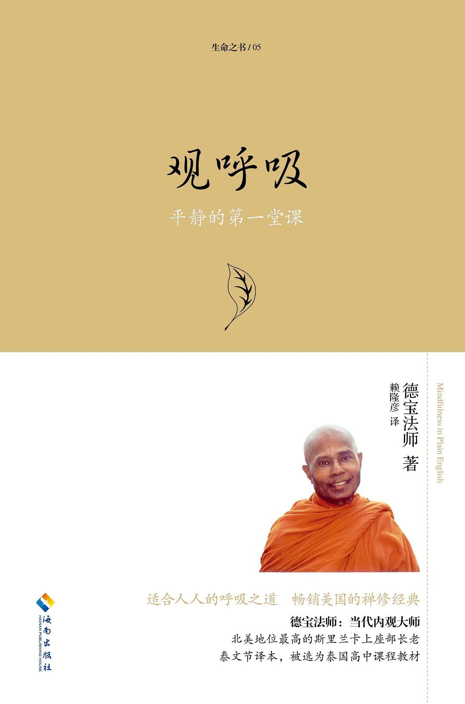

---
title: "介绍德宝法师的禅修指导书：《观呼吸》"
slug: "介绍德宝法师的禅修指导书：《观呼吸》"
date: 2025-08-07T10:48:48+08:00
summary: "今天在博客上分享一本关于禅修实践的书籍：《观呼吸》（Mindfulness in Plain English），作者是德宝法师（Bhante Henepola Gunaratana）。这本书主要阐述了源于佛教上座部传统的“安那般那念”（Ānāpānasati）禅法，即以观察呼吸为核心的禅修方法。

" 
draft: false    
tags: ["电子书"]
---

- [直接下载](#section1)

*导语： 今天在博客上分享一本关于禅修实践的书籍：《观呼吸》（Mindfulness in Plain English），作者是德宝法师（Bhante Henepola Gunaratana）。这本书主要阐述了源于佛教上座部传统的“安那般那念”（Ānāpānasati）禅法，即以观察呼吸为核心的禅修方法。*

关于《观呼吸》这本书
核心主题： 本书的核心内容围绕观察呼吸这一具体禅修方法展开。它详细说明了如何将呼吸作为禅修的专注对象。

### 内容结构：

基础准备： 书中首先介绍了禅修的基本概念、目的（培养专注力与觉知力），以及进行禅修所需的环境和心态准备。

实践指导： 重点在于提供具体的操作指引。这包括：

如何调整坐姿以达到稳定舒适。

如何选择并专注于呼吸的观察点（例如鼻端触感或腹部起伏）。

如何将注意力持续地安住在呼吸上。

如何处理禅修过程中可能出现的常见身心现象（如腿痛、昏沉、散乱、情绪波动等）。

概念阐释： 书中对禅修中涉及的一些关键概念（如“定”、“慧”、“念”、“禅相”等）进行了说明。

答疑解惑： 针对禅修者在实践中可能遇到的典型困惑和疑问，作者提供了基于传统的解答和指导。

写作风格： 德宝法师的叙述风格以清晰、直接、实用著称。他力求用平实的语言解释禅修方法，使其易于理解和操作。

### 方法特点：

强调实践： 本书着重于提供可操作的禅修步骤和技巧。

循序渐进： 指导过程体现了从基础到深入的渐进性。

以呼吸为锚点： 书中指出呼吸是一个简单、直接、无时无刻不在的观察对象，适合作为禅修的基础。

培养心智能力： 书中阐述，通过持续练习观察呼吸，旨在培养心的专注力（集中于单一对象的能力）和觉知力（清晰了知当下身心状态的能力）。

背景与定位： 虽然书中方法植根于佛教上座部禅修传统，但作者在阐述时侧重于方法的实践层面。因此，它常被不同背景的读者视为一本关于正念冥想核心练习的实用手册。

### 书籍面向的读者

对正念（Mindfulness）、冥想（Meditation） 或禅修实践感兴趣的读者。

希望了解如何具体进行以呼吸为对象的禅修方法的读者。

寻求关于禅修基础实践指导和常见问题解答的读者。

### 关于分享

这本书提供了关于“观呼吸”禅法的一套系统说明和实践指南。对于有兴趣了解或尝试这一特定禅修方法的朋友，书中包含了详细的步骤和说明。

（欢迎在评论区交流你对禅修或相关书籍的看法。）

### 下载地址：

 https://cloud.189.cn/web/share?code=m6buqmVvUrMj（访问码：jto1）