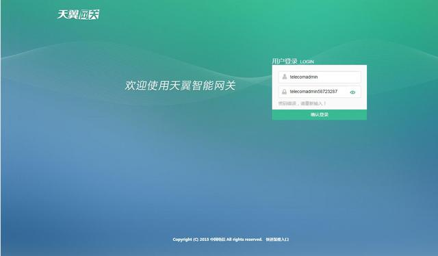
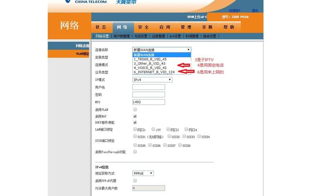
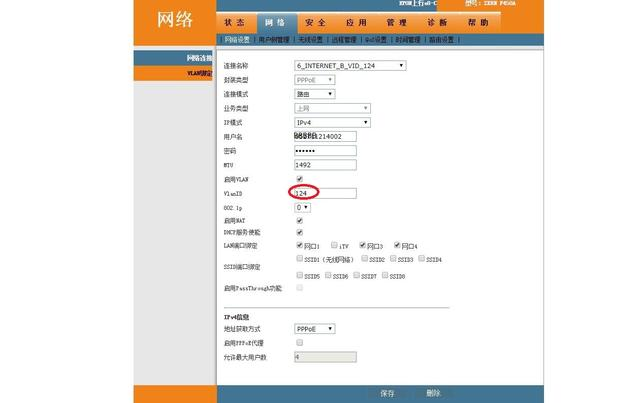
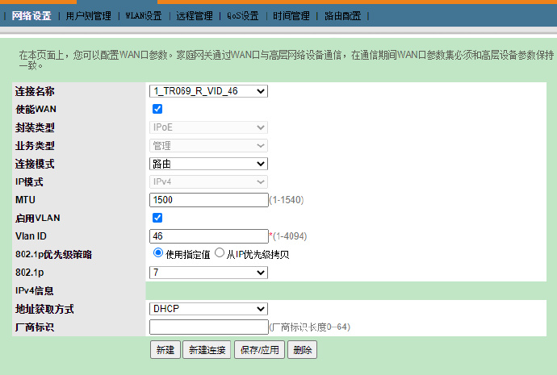
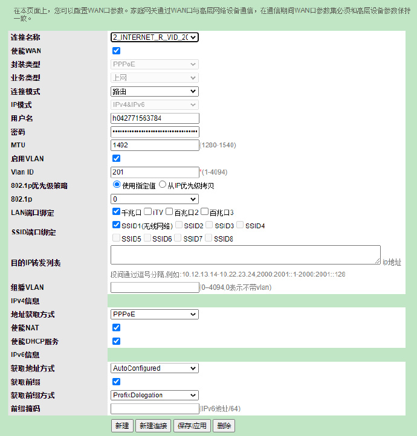

---
title:      "电信天翼网关路由改桥接流程"
slug: "电信天翼网关路由改桥接流程"
date:       2023-04-27
categories:   ['记录']
tags: ['记录']
---

大家好，好多网友要求我发一份网关路由改桥接的流程，由于平日工作太忙，更新点有慢，以后会多多分享平日工作中碰到的一些关于网络的各种问题。
<!--more-->
路由改桥接首先准备以下两样。

1.网关一台（不管是四口还是二口都可以）

2.光猫超级密码，有些朋友说找不到超级密码，网上有些教程已经无用了。对于这种问题我觉得打电话给宽带安装的时候沟通一下，跟他好好说一下，应该都能提供给你。如果他不愿意给你的话，那只能打10000号报障碍，让他上门。买包烟应该也能搞定。毕竟对于他们来说这都是一件微不足道的小事。

首先进入光猫配置网址，一般都是192.168.1.1 进入以后输入用户名和超级密码

进入以后,选则网络------网络设置

选则连接名称会发现有以上几个选项，上图都有介绍各选项是干嘛用的。

然后选则Internet那一项

然后会看到有好多选项，不用管那么多，只要记得Vlan ID那个数字就好了。

然后选则右下角删除，等删除完毕后。点击连接名称 选则新建Wan连接

连接模式选桥接，IP模式选IPV4，启用Vlan打勾，然后输入你刚记住的VlanID，LAN端口绑定如果没有IPTV可以全部打勾，如果有Iptv就不选。SSID就是光猫自带的无线。可以全部关闭。最后保存。保存好了以后用拨号连接测试一下就OK。那个VlanID一定要填写，否则拨号是不成功的。 最后提醒一下那个超级密码是只能使用一次，使用以后在登陆后台就会更新新密码。以上教程就到这了，有什么问题下方留言我会一一回答。

田家的：
先设置电信的光猫，进后台 192.168.1.1 用户名：telecomadmin，密码是：E7jA%5m，网络------网络设置里面有设置截图保存一下，以备之后恢复时候使用，比如我的截图如下：

原始设置截图

第二个原始截图备份
记住Vlan ID 我的是201。拨号的用户名是h042771563784密码是123456

要设置桥接就把“路由”的那一栏一点就出现桥接，选中之后就完成了电信猫的设置。

下一步就把网线的另一端接到无线路由的WAN口，LAN口弄条网线一头接电脑，另一头随便找个无线路由的LAN口。进无线路由设置LAN的IP段为192.168.2.1，重启，再设置PPPOE拨号，用户名是h042771563784密码是123456，设置WIFI的用户名密码。
